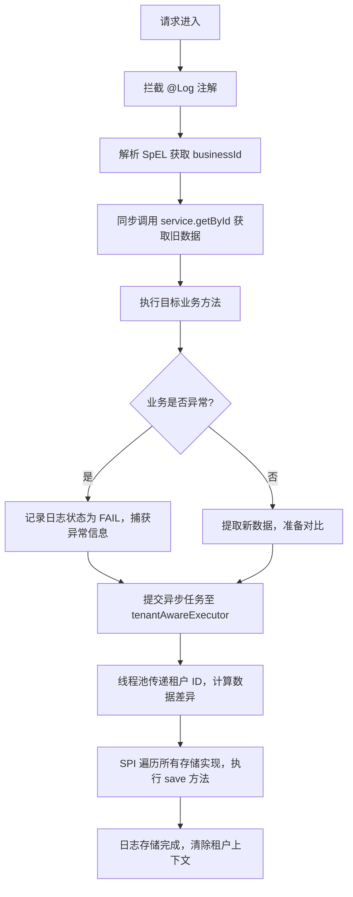

# 审计日志组件 (AuditLog) 技术文档
**文档版本**：v1.0.0
**最后更新**：2026-03-23
**适用范围**：基于 Spring Boot 3.x + JDK 17 的多租户架构项目
**维护责任人**：全栈开发团队
**变更记录**：[见下方更新日志](#更新日志)

## 文档说明
本文档为审计日志组件的**官方维护文档**，涵盖组件使用、配置、扩展、排障全流程，后续功能迭代、问题修复、优化点均会同步更新至本文档。

---

## 更新日志
| 版本号   | 更新时间   | 变更类型       | 变更内容                                                                 | 变更人 | 备注       |
|----------|------------|----------------|--------------------------------------------------------------------------|--------|------------|
| v1.0.0   | 2026-03-23 | 初始版本       | 完成组件核心功能文档编写，包含使用指南、配置要求、执行流程等基础内容       | 架构组 | 首次发布   |
| v1.0.1   | -          | 预留迭代       | 计划新增：Elasticsearch 存储实现、字段脱敏功能、前端日志查询示例          | -      | 待开发     |
| v1.0.2   | -          | 预留迭代       | 计划优化：SpEL 解析性能、大对象 diff 对比效率、异常监控告警               | -      | 待优化     |

---

## 1. 组件概述
`AuditLogAspect` 是基于 Spring AOP + JDK SPI 构建的高性能审计留痕组件，专为多租户（Multi-tenant）架构设计，核心解决「业务操作留痕、数据变更追溯、租户信息隔离」三大问题。

### 核心价值
- 非侵入式：通过注解 + AOP 实现，无需修改业务代码
- 高性能：异步线程池执行日志存储，不阻塞主业务流程
- 易扩展：SPI 插件化存储，支持多介质同时输出（DB/ES/MQ）
- 高兼容：适配多租户场景，保证异步线程上下文不丢失

---

## 2. 核心特性
| 特性分类   | 具体能力                                                                 | 应用场景                     |
|------------|--------------------------------------------------------------------------|------------------------------|
| 上下文管理 | 基于 `InheritableThreadLocal` + `TaskDecorator` 传递租户 ID              | 异步任务中保留租户身份       |
| 数据对比   | 反射 + 深拷贝实现字段级数据差异对比，生成结构化变更日志                   | 记录「谁改了什么、改前改后」 |
| 异步执行   | 自定义安全线程池，避免线程复用导致的租户串透                             | 高并发业务操作留痕           |
| 插件化存储 | JDK SPI 机制实现存储介质热插拔，支持同时启用多个存储实现                 | 日志多端同步（DB+ES）        |
| 多租户隔离 | 所有日志自动关联租户 ID，保证不同租户日志数据物理隔离                     | SaaS 多租户系统              |

---

## 3. 环境依赖
### 3.1 基础环境
| 依赖项       | 版本要求 | 备注                     |
|--------------|----------|--------------------------|
| JDK          | 17+      | 兼容 Spring Boot 3.x 要求 |
| Spring Boot  | 3.x      | 核心依赖 AOP、Async 模块  |
| MyBatis-Plus | 3.5+     | 可选，数据库存储时依赖    |
| Hutool       | 5.8+     | 必选，用于 Bean 深拷贝    |

### 3.2 强制配置 Bean
组件运行依赖以下 Spring Bean，需在项目配置类中显式定义：
| Bean 名称          | 类型       | 作用                                                                 |
|--------------------|------------|----------------------------------------------------------------------|
| `tenantAwareExecutor` | Executor   | 租户感知的异步线程池，需挂载 `TenantContextDecorator` 装饰器         |
| `SpringContextHolder` | 工具类     | 用于 SPI 实现类获取 Spring 容器中的 Mapper/Service（非 Spring 管理）|

---

## 4. 快速使用指南
### 4.1 引入组件
#### 步骤1：添加依赖（pom.xml）
```xml
<dependencies>
    <!-- 核心依赖 -->
    <dependency>
        <groupId>org.springframework.boot</groupId>
        <artifactId>spring-boot-starter-aop</artifactId>
    </dependency>
    <!-- 工具类 -->
    <dependency>
        <groupId>cn.hutool</groupId>
        <artifactId>hutool-all</artifactId>
        <version>5.8.20</version>
    </dependency>
    <!-- 可选：MyBatis-Plus（数据库存储时需引入） -->
    <dependency>
        <groupId>com.baomidou</groupId>
        <artifactId>mybatis-plus-spring-boot3-starter</artifactId>
        <version>3.5.5</version>
    </dependency>
</dependencies>
```

#### 步骤2：启用注解
在 Spring Boot 启动类添加异步注解：
```java
@SpringBootApplication
@EnableAsync // 启用异步线程池
public class BootstrapApplication {
    public static void main(String[] args) {
        SpringApplication.run(BootstrapApplication.class, args);
    }
}
```

### 4.2 基础使用
#### 场景1：仅记录操作（无数据对比）
在 Service/Controller 方法上添加 `@Log` 注解，记录操作人、模块、耗时等基础信息：
```java
@Service
public class UserExportService {
    @Log(module = "用户管理", operation = "导出用户数据")
    public void exportUserList(String tenantId, Long deptId) {
        // 业务逻辑：导出用户列表
    }
}
```

#### 场景2：记录数据变更（核心场景）
指定 `serviceName`（用于查询旧数据）和 `businessId`（SpEL 解析业务主键），自动对比数据变更：
```java
@Service("userService") // 需与 @Log 的 serviceName 一致
public class UserServiceImpl implements UserService {
    @Override
    @Log(
            module = "用户管理",
            // 动态 Operation：结合参数和结果
            operation = "'修改用户[' + #userDto.nickname + ']状态' + (#result ? '成功' : '失败')",
            // 动态 BusinessId
            businessId = "#userDto.id",
            // 核心：指定 Service 名字，切面会自动在执行前后各查一次数据库做 Diff
            serviceName = "userServiceImpl"
    )
    public boolean updateUserStatus(UserDTO userDto) {
        return userRepository.updateStatus(userDto);
    }
}
```

### 4.3 `@Log` 注解参数详解
| 参数名       | 类型   | 必填 | 默认值 | 说明                                                                 |
|--------------|--------|------|--------|----------------------------------------------------------------------|
| `module`     | String | 是   | -      | 业务模块名称（如：订单中心、商品管理）                               |
| `operation`  | String | 是   | -      | 具体操作描述（如：创建订单、修改商品价格）                           |
| `serviceName`| String | 否   | ""     | 用于查询旧数据的 Service Bean 名称，需实现 `getById(Serializable)` 方法 |
| `businessId` | String | 否   | ""     | SpEL 表达式，解析业务主键（如：#id、#req.orderNo）                   |

---

## 5. 核心配置说明
### 5.1 租户上下文配置（TenantContextHolder）
```java
package me.link.bootstrap.core.tenant;

import lombok.extern.slf4j.Slf4j;

@Slf4j
public class TenantContextHolder {
    // 继承式 ThreadLocal，保证子线程能获取主线程的租户 ID
    private static final ThreadLocal<String> TENANT_CONTEXT = new InheritableThreadLocal<>();

    /** 设置租户 ID */
    public static void setTenantId(String tenantId) {
        TENANT_CONTEXT.set(tenantId);
        log.debug("租户上下文设置：{}", tenantId);
    }

    /** 获取租户 ID */
    public static String getTenantId() {
        return TENANT_CONTEXT.get();
    }

    /** 清除租户上下文（必须在请求结束/线程执行完毕后调用） */
    public static void clear() {
        TENANT_CONTEXT.remove();
        log.debug("租户上下文已清除");
    }
}
```

### 5.2 异步线程池配置（AsyncConfig）
```java
package me.link.bootstrap.core.config;

import me.link.bootstrap.core.tenant.TenantContextHolder;
import org.springframework.context.annotation.Bean;
import org.springframework.context.annotation.Configuration;
import org.springframework.core.task.TaskDecorator;
import org.springframework.scheduling.annotation.EnableAsync;
import org.springframework.scheduling.concurrent.ThreadPoolTaskExecutor;

import java.util.concurrent.Executor;
import java.util.concurrent.ThreadPoolExecutor;

@Configuration
@EnableAsync
public class AsyncConfig {
    /** 租户感知的异步线程池 */
    @Bean(name = "tenantAwareExecutor")
    public Executor tenantAwareExecutor() {
        ThreadPoolTaskExecutor executor = new ThreadPoolTaskExecutor();
        // 核心线程数
        executor.setCorePoolSize(10);
        // 最大线程数
        executor.setMaxPoolSize(50);
        // 队列容量
        executor.setQueueCapacity(200);
        // 线程前缀
        executor.setThreadNamePrefix("audit-log-");
        // 拒绝策略：调用者执行（避免日志丢失）
        executor.setRejectedExecutionHandler(new ThreadPoolExecutor.CallerRunsPolicy());
        // 租户上下文装饰器（核心：传递租户 ID）
        executor.setTaskDecorator(new TenantContextDecorator());
        // 初始化
        executor.initialize();
        return executor;
    }

    /** 租户上下文装饰器 */
    static class TenantContextDecorator implements TaskDecorator {
        @Override
        public Runnable decorate(Runnable runnable) {
            // 捕获主线程的租户 ID
            String tenantId = TenantContextHolder.getTenantId();
            return () -> {
                try {
                    // 给异步线程设置租户 ID
                    TenantContextHolder.setTenantId(tenantId);
                    runnable.run();
                } finally {
                    // 执行完毕后清除，避免线程复用导致串透
                    TenantContextHolder.clear();
                }
            };
        }
    }
}
```

### 5.3 SPI 存储注册
#### 步骤1：创建 SPI 配置文件
在 `resources/META-INF/services/` 目录下创建文件，文件名：`me.link.bootstrap.core.log.spi.AuditLogStorage`

#### 步骤2：写入实现类全限定名
```text
# 数据库存储实现
me.link.bootstrap.core.log.spi.impl.DbAuditLogStorage
# 可选：添加 ES 存储实现（后续迭代）
# me.link.bootstrap.core.log.spi.impl.EsAuditLogStorage
```

---

## 6. 执行流程


---

## 7. 维护指南
### 7.1 版本迭代规范
1. 小版本（v1.0.x）：修复 bug、优化性能、新增小功能（如脱敏）
2. 大版本（v1.x.0）：重构核心逻辑、新增核心功能（如分布式追踪）
3. 所有变更需同步更新「更新日志」，并标注变更人、变更内容

### 7.2 问题排查步骤
| 问题现象               | 排查方向                                                                 |
|------------------------|--------------------------------------------------------------------------|
| 日志缺失租户 ID        | 1. 检查请求是否传递 X-Tenant-Id<br>2. 检查线程池是否配置 TenantContextDecorator |
| 数据对比结果为空       | 1. 检查 serviceName 是否与 @Service 注解一致<br>2. 检查 businessId SpEL 表达式是否正确 |
| 异步日志存储失败       | 1. 检查线程池拒绝策略是否生效<br>2. 检查 SPI 实现类是否正确注册<br>3. 查看 audit-log-* 线程日志 |
| 租户 ID 串透           | 1. 检查线程执行完毕后是否调用 TenantContextHolder.clear()<br>2. 检查线程池是否复用过度 |

### 7.3 性能优化建议
1. 对 `getById` 方法的数据库字段建立索引，减少同步查询耗时
2. 大对象（字段 > 50 个）建议自定义 diff 规则，避免全字段对比
3. 线程池参数根据业务 QPS 调整（核心线程数 = CPU 核心数 * 2）
4. 日志存储建议批量插入（如每 100 条批量提交），减少数据库 IO

---

## 8. 常见问题 (FAQ)
### Q1：为什么异步线程中获取不到租户 ID？
A1：需检查两点：
- 线程池是否配置 `TenantContextDecorator` 装饰器
- 是否在请求入口（如拦截器）正确设置 `TenantContextHolder.setTenantId()`

### Q2：SpEL 表达式解析失败怎么办？
A2：
1. 检查表达式语法（如：#dto.id 需确保方法参数有 dto 对象且包含 id 字段）
2. 补充 SpEL 解析异常捕获（后续迭代会优化）

### Q3：能否同时将日志存入数据库和 ES？
A3：可以，只需在 SPI 配置文件中添加多个实现类，组件会遍历所有实现类执行 `save` 方法。

---

## 9. 附录
### 9.1 数据库表结构（MySQL）
```sql
CREATE TABLE `audit_log` (
  `id` bigint NOT NULL AUTO_INCREMENT COMMENT '主键ID',
  `tenant_id` varchar(50) NOT NULL COMMENT '租户ID',
  `module` varchar(100) NOT NULL COMMENT '业务模块',
  `operation` varchar(200) NOT NULL COMMENT '操作描述',
  `business_id` varchar(100) DEFAULT NULL COMMENT '业务主键',
  `operator` varchar(50) DEFAULT NULL COMMENT '操作人',
  `cost_time` varchar(20) DEFAULT NULL COMMENT '耗时(ms)',
  `status` varchar(10) DEFAULT 'SUCCESS' COMMENT '状态：SUCCESS/FAIL',
  `error_msg` text COMMENT '异常信息',
  `changes` json DEFAULT NULL COMMENT '字段变更明细',
  `create_time` datetime DEFAULT CURRENT_TIMESTAMP COMMENT '创建时间',
  PRIMARY KEY (`id`),
  KEY `idx_tenant_id` (`tenant_id`),
  KEY `idx_business_id` (`business_id`),
  KEY `idx_create_time` (`create_time`)
) ENGINE=InnoDB DEFAULT CHARSET=utf8mb4 COMMENT='审计日志表';
```

### 9.2 字段变更明细 JSON 示例
```json
[
  {
    "fieldName": "userName",
    "oldValue": "张三",
    "newValue": "李四",
    "fieldDesc": "用户名"
  },
  {
    "fieldName": "phone",
    "oldValue": "13800138000",
    "newValue": "13900139000",
    "fieldDesc": "手机号"
  }
]
```

---

### 总结
1. 本文档为**可持续迭代**的审计日志组件维护文档，核心包含「使用、配置、维护、排障」四大核心模块，后续变更会同步至「更新日志」；
2. 组件核心依赖「租户上下文传递」和「SPI 插件化存储」，使用时需确保线程池装饰器配置正确、SPI 实现类注册到位；
3. 问题排查优先关注「租户 ID 传递」「SpEL 解析」「线程池配置」三大核心点，可快速定位 90% 以上的异常。